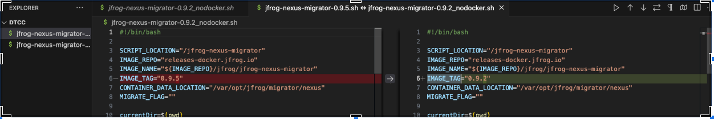

# Nexus Migrator Script (Without Docker)

The Nexus migrator tool in [Migrating from Sonatype Nexus Repository Manager to Artifactory](https://jfrog.com/help/r/jfrog-installation-setup-documentation/migrating-from-sonatype-nexus-repository-manager-to-artifactory) requires a docker  environment in the Nexus 3.x server.

If Docker cannot be installed  on the Nexus 3.x server  then use the script from [jfrog-nexus-migrator-0.9.2_nodocker.sh](jfrog-nexus-migrator-0.9.2_nodocker.sh)

## Prerequisites

Since Docker is not used, you need to download and install the JFrog CLI manually. You can do this by running the following command from [Get JFrog CLI](https://jfrog.com/getcli/):

```sh
curl -fL https://install-cli.jfrog.io | sh
```

If you cannot install it directly, you can download it using:

```sh
curl -fkL https://getcli.jfrog.io/v2-jf | sh
```

## Script Usage

1. **Download the Script:**
   Use the script [jfrog-nexus-migrator-0.9.2_nodocker.sh](jfrog-nexus-migrator-0.9.2_nodocker.sh) for the migration. 

   Note: Compare the downloaded script with the latest version from [JFrog Nexus Migrator Releases](https://releases.jfrog.io/artifactory/run/nexus-migrator) to ensure it is up to date. This script does not use Docker images, so the `IMAGE_TAG="0.9.2"` variable can remain as is.



2. **Run the Migration Script:**
   Follow the instructions provided in the 
   [Migrating specific repositories from Nexus3 to Artifactory.pdf](Migrating%20specific%20repositories%20from%20Nexus3%20to%20Artifactory.pdf)  document.


## Notes

- Ensure you have the necessary permissions to execute scripts and install tools on your server.
